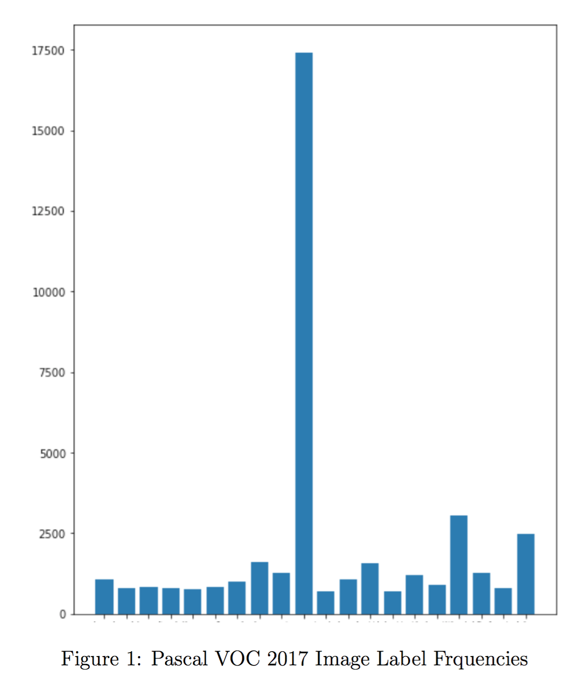

# ImbalancedMLC
The influence of an imbalanced dataset on the efficacy of classification models has been thoroughly and extensively studied for single-label classification (SLC) problems. These are problems that require a binary classification output to predict the existence of a single class in a given input instance. In the domain of multi-label classification (MLC), a single input instance may have multiple classes associated with it. As a result of this intrinsic label concurrence, many of the dataset imbalance remedies applied to single-label classification problems are ineffective and possibly detrimental when applied to a multi-label dataset (MLD). For example, one of the most common SLC imbalance remedies is random oversampling; that is, randomly duplicating instances with associated labels that are uncommon. If we apply this naive approach to a MLD, we will likely duplicate undesired labels that are simultaneously present in the input instance, possibly even increasing the severity of the dataset imbalance.

This is an empirical analysis of the efficacy of several state-of-the-art methods on imbalanced Multilabel Classification datasets.

# Experimental Setup
In our experiments we use the 2017 Pascal VOC image database using a custom 90%/10% train/val dataset split,
manually partitioning the provided Pascal VOC train/val dataset. This results in 10337 train and 1153 validation images.
The label distribution can be seen in Figure 1. This includes counts of multiple occurrences of a single label in one input instance.

Our baseline model consists of an XceptionNet architecture with a final fully-connected layer with 20 outputs,
one for each label in the Pascal VOC label set. The network is initalized with ImageNet weights.
During training we apply several image augmentations to the input images including random flips, rotations,
shears, crops, gaussian blur, and contrast normalization. We also apply pixel-wise mean subtraction. 
We use a batch size of 24 and stochastic gradient descent with Nesterov momentum of 0.9 at an initial learning rate of 0.01.
We train for 500 epochs, processing 100 batches per epoch. Our baseline model uses categorical cross entropy as a loss function.

To tackle the multilabel problem, we may either apply a sigmoidal or a two-dimensional softmax activation on each element of the output vector.

All network features are implemented with Keras.

# Methods
Below are some of the publicly available methods used in the experiments. 

## Loss Functions
### Crossentropy
### Balanced Crossentropy
### Weighted Crossentropy
### Focal Loss (https://arxiv.org/abs/1708.02002)
### Dice Loss

## Sampling Algorithms
### ML-ROS (https://arxiv.org/abs/1802.05033)
### REMEDIAL (https://arxiv.org/abs/1802.05033)

